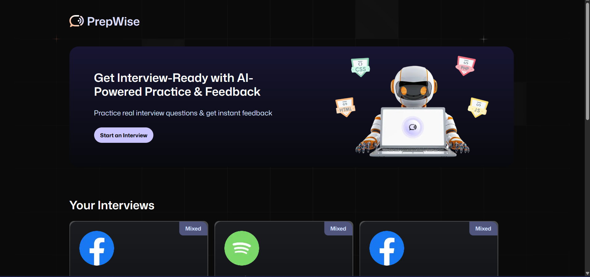

# Prepwise: AI-Powered Interview Preparation Platform



Prepwise is a comprehensive job interview preparation platform powered by Vapi AI Voice agents, designed to help job seekers practice and improve their interview skills with realistic AI-driven interviews.

[Live Demo](https://ai-mock-interview-mtci.vercel.app/) | [Watch Tutorial](https://youtube.com/javascriptmastery)

## 📋 Table of Contents
- [🤖 Introduction](#-introduction)
- [⚙️ Tech Stack](#️-tech-stack)
- [🔋 Features](#-features)
- [🤸 Quick Start](#-quick-start)
- [🕸️ Snippets (Code to Copy)](#️-snippets-code-to-copy)
- [🔗 Assets](#-assets)
- [🚀 More](#-more)
- [🚨 Tutorial](#-tutorial)

## 🤖 Introduction

Built with Next.js for the user interface and backend logic, Firebase for authentication and data storage, styled with TailwindCSS and using Vapi's voice agents, Prepwise is a website project designed to help you learn integrating AI models with your apps. The platform offers a sleek and modern experience for job interview preparation.

If you're getting started and need assistance or face any bugs, join our active Discord community with over 50k+ members. It's a place where people help each other out.

## ⚙️ Tech Stack

- **Next.js** - React framework for building the UI and backend
- **Firebase** - Authentication and database
- **Tailwind CSS** - Styling and UI components
- **Vapi AI** - Voice agent integration
- **shadcn/ui** - UI component library
- **Google Gemini** - AI language model
- **Zod** - Schema validation

## 🔋 Features

👉 **Authentication**: Sign Up and Sign In using password/email authentication handled by Firebase.

👉 **Create Interviews**: Easily generate job interviews with help of Vapi voice assistants and Google Gemini.

👉 **Get feedback from AI**: Take the interview with AI voice agent, and receive instant feedback based on your conversation.

👉 **Modern UI/UX**: A sleek and user-friendly interface designed for a great experience.

👉 **Interview Page**: Conduct AI-driven interviews with real-time feedback and detailed transcripts.

👉 **Dashboard**: Manage and track all your interviews with easy navigation.

👉 **Responsiveness**: Fully responsive design that works seamlessly across devices.

And many more, including code architecture and reusability.

## 🤸 Quick Start

Follow these steps to set up the project locally on your machine.

### Prerequisites

Make sure you have the following installed on your machine:

- Git
- Node.js
- npm (Node Package Manager)

### Cloning the Repository

```bash
git clone https://github.com/adrianhajdin/ai_mock_interviews.git
cd ai_mock_interviews
```

### Installation

Install the project dependencies using npm:

```bash
npm install
```

### Set Up Environment Variables

Create a new file named `.env.local` in the root of your project and add the following content:

```
NEXT_PUBLIC_VAPI_WEB_TOKEN=
NEXT_PUBLIC_VAPI_WORKFLOW_ID=

GOOGLE_GENERATIVE_AI_API_KEY=

NEXT_PUBLIC_BASE_URL=

NEXT_PUBLIC_FIREBASE_API_KEY=
NEXT_PUBLIC_FIREBASE_AUTH_DOMAIN=
NEXT_PUBLIC_FIREBASE_PROJECT_ID=
NEXT_PUBLIC_FIREBASE_STORAGE_BUCKET=
NEXT_PUBLIC_FIREBASE_MESSAGING_SENDER_ID=
NEXT_PUBLIC_FIREBASE_APP_ID=

FIREBASE_PROJECT_ID=
FIREBASE_CLIENT_EMAIL=
FIREBASE_PRIVATE_KEY=
```

Replace the placeholder values with your actual Firebase and Vapi credentials.

### Running the Project

```bash
npm run dev
```

Open [http://localhost:3000](http://localhost:3000) in your browser to view the project.

## 🕸️ Snippets (Code to Copy)

The repository contains all the code needed to get the project up and running. Key code snippets and components can be found in their respective directories:

- `/app` - Main application routes and pages
- `/components` - Reusable UI components
- `/lib` - Utility functions and configurations
- `/public` - Static assets

## 🔗 Assets

All project assets including images, icons, and other media files are stored in the `/public` directory.

## 🚀 More

For more information about the technologies used:

- [Next.js Documentation](https://nextjs.org/docs)
- [Firebase Documentation](https://firebase.google.com/docs)
- [Tailwind CSS Documentation](https://tailwindcss.com/docs)
- [Vapi AI Documentation](https://docs.vapi.ai/)
- [shadcn/ui Documentation](https://ui.shadcn.com/)
- [Google Gemini Documentation](https://ai.google.dev/docs)

## 🚨 Tutorial

This repository contains the code corresponding to an in-depth tutorial available on our YouTube channel, [JavaScript Mastery](https://youtube.com/javascriptmastery).

If you prefer visual learning, this is the perfect resource for you. Follow our tutorial to learn how to build projects like these step-by-step in a beginner-friendly manner!

---

Built with ❤️ by [JavaScript Mastery](https://www.jsmastery.pro)